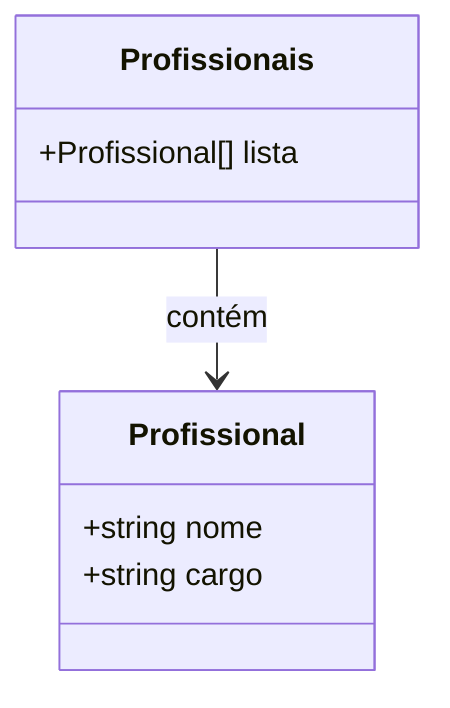

# Sobre

## Problema vs Solução

O projeto foi desenvolvido para a **UBS 2 de Itatiaia do Alto Bonito**, distrito de São José do Jacuípe.

Durante meu trabalho na recepção, percebi que alguns re-agendamentos não eram comunicados a determinados pacientes por falta de contato. Como há muitos pacientes, criei esta aplicação para **automatizar o envio de mensagens**.

Atualmente, a aplicação **não requer autenticação**, pois será usada apenas em uma **máquina local**, mas futuramente pode ser aprimorada.

Combinando **Express + ReactJS + Venom-Bot**, criei um formulário simples que pede **nome** e **telefone** do paciente e envia uma mesma mensagem para os demais pacientes de forma personalizada.

Exemplo de mensagem enviada:

```
O seu atendimento com a $p_nome foi remarcado para o dia 25/09/25.
```

Os parâmetros serão substituídos automaticamente para cada paciente.

---

## JSON de Profissionais

Optei por **não usar banco de dados** no momento, mantendo a estrutura simples. Os profissionais estão armazenados manualmente em um JSON (`profissional.json`) na raiz do projeto, com a seguinte estrutura:

```ts
interface Profissional {
  nome: string; // Nome do profissional
  cargo: string; // ex.: Médico(a), Enfermeiro(a)
}

const profissionais: Profissional[] = [{...}, {...}, {...}];
```

Diagrama Mermaid representando a estrutura:



---

## Transcrição de imagens

O sistema tenta **transcrever imagens** de agendamentos para facilitar a entrada de dados, extraindo nomes e telefones.
Observação: a precisão depende da qualidade da imagem e da biblioteca escolhida.

---

## Formato para identificar pacientes

No formulário, há um **campo de texto grande** que aceita vários nomes e telefones de uma vez, seguindo este padrão:

```txt
nome1, telefone1
nome2, telefone2
```

Ao clicar no botão **Identificar**, o sistema separa automaticamente os valores por vírgula e cria campos individuais de **nome** e **telefone** para cada paciente.

---

Se você quiser, posso criar um **diagrama Mermaid extra** mostrando **todo o fluxo do sistema**, desde o formulário até o envio da mensagem pelo Venom-Bot, incluindo o JSON de profissionais e os pacientes. Isso deixaria a documentação bem visual.

Quer que eu faça isso?
